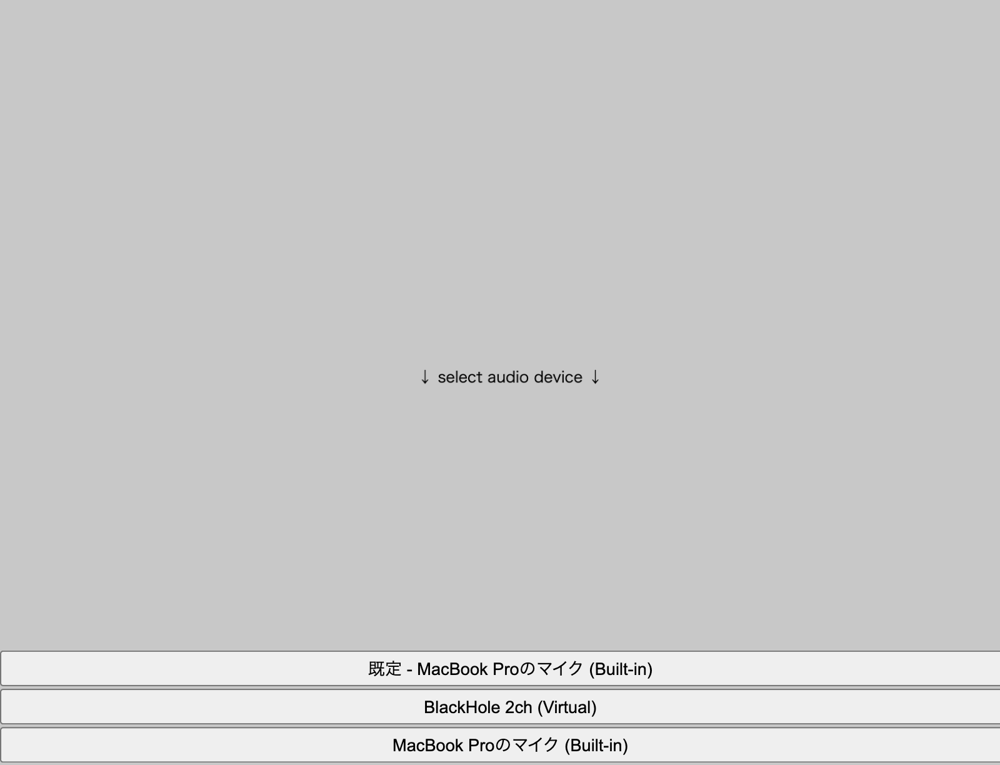

# p5.audio-picker
A library for creating audio source selection buttons for p5.sound.js.

DEMO: [https://izm51.github.io/p5.audio-picker/](https://izm51.github.io/p5.audio-picker/)


(The buttons at the bottom of the image was created with this library.)
## Installation
Link [p5.audio-picker.js](./p5.audio-picker.js) or [p5.audio-picker.min.js](./p5.audio-picker.min.js) from your HTML file. You will also need to link p5.js and p5.sound.js first. Check [index.html](./docs/index.html) for an example.

## Usage examples

### getSources()

```js
const audioSources = await AudioPicker.getSources();
```
- Show a dialog to prompt to use a microphone
- Get audio sources you can use
- (Return a list of audio souces)

### setSource()
```js
setSource(2)
```
- Set input source and start audioIn.
- Param: {Int} An index in the array returned by getSources().

### createButtons()
```js
const bttons = AudioPicker.createButtons(() => {
  fft = new p5.FFT();
  fft.setInput(audioIn);
})
```
- Create buttons that displays each label of audio sources.
- When pressed the button, setSource at the index of that button and removeButtons.
- Param: {Function} onPressed()
- Return Buttons
  
```js
buttons.addStyleToButtons((btn, index, length) => {
  btn.size(width, 28);
  btn.position(0, index * 30);
});
```
- You can add styles to the buttons.
- Param: {Function} elementMethods(btn [, index, buttons.length])
  - Please refer to [https://p5js.org/reference/#/p5.Element](https://p5js.org/reference/#/p5.Element)  what's available
- Return Buttons

### Getters
```js
AudioPicker.audioIn
```
- Return p5.AudioIn

```js
AudioPicker.isMicAllowed
```
- Return Boolean
- Whether the use of microphones is allowed.

```js
AudioPicker.isPicked
```
- Return Boolean
- Whether the AudioSource to use is already selected.